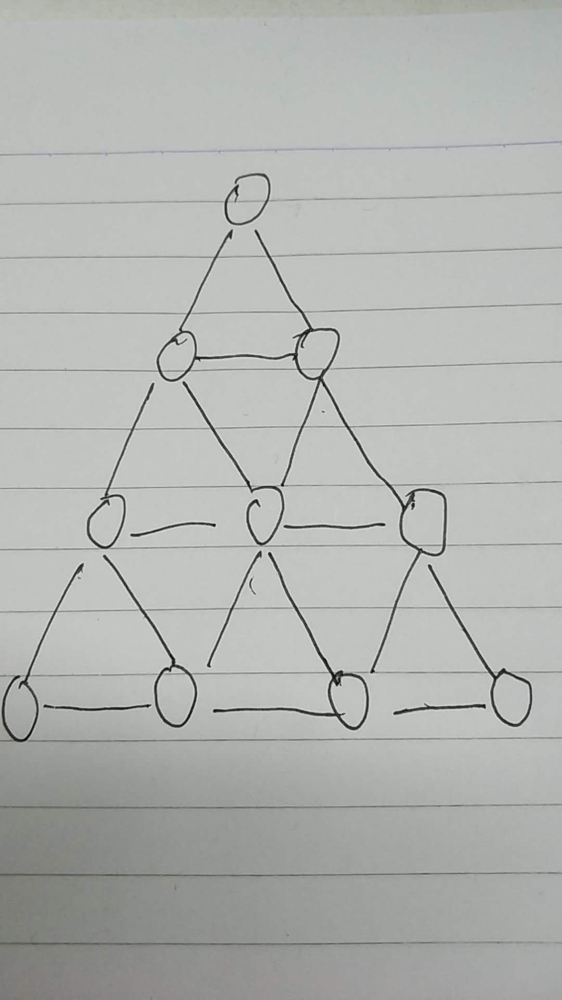
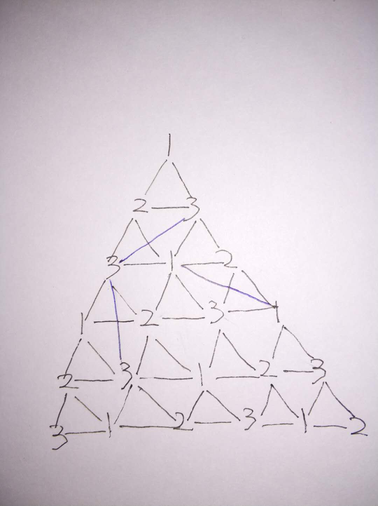
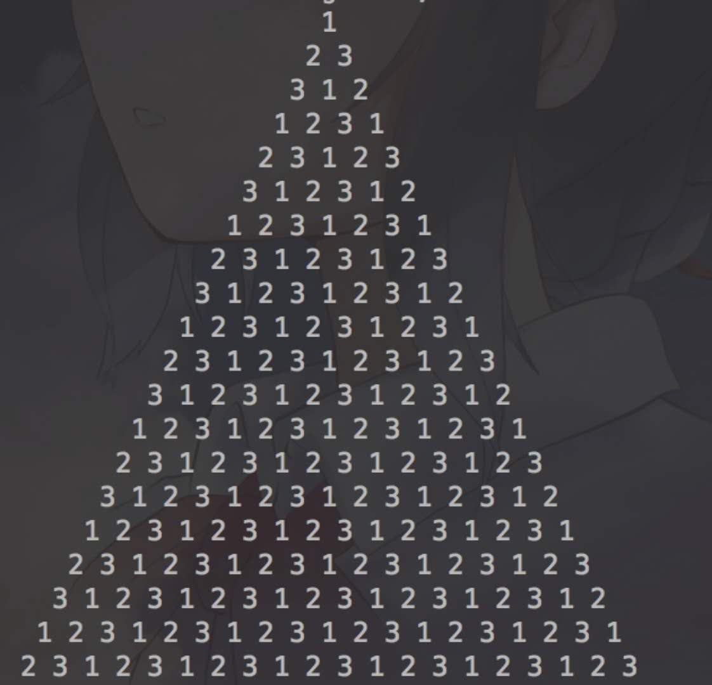

## 前言  
最近面试一个非常心仪的职位，结果跪在一道算法题目上，让我几晚都睡不着，翻来覆去。面试失败后回去，结果当晚花了不到十分钟就解决了这个看似很难，实际上非常简单的题目。现在已经过去了，总结下这个问题，顺便给博客开了算法模块。  

## 题目
有一个N层的金字塔，第一层（最顶层）有一个格子，第二层有2个格子，第三层有3个格子，第N层有N个格子，如图  
  

现有3种不同的颜色，对所有的格子进行填充，要求每相邻的格子的颜色不能相同。  

## 分析
在做这道题目的时候，面试官曾经给过很好的提示，就是找到它的规律。其实这句话已经很明显了，现在回头想想，我们多画几层看看，就知道最终的结果到底能带出什么规律了。  
  

总的规律就是  
> 1.确定前2层的三个节点后，就能确认下面所有层的节点填充的颜色  
> 2.每一层的第一个跟斜上角的节点填充的颜色一致  
> 3.每一层最后一个节点填充颜色跟左斜上角的一致  
> 4.中间部分节点颜色跟顶上的对角的颜色一致  

具体看上面那个图的蓝色线条部分画出的对角线。所以就是这样，非常简单，规律也很简单。  

## 实现
面试还犯了一个严重的错误就是，这个金字塔到底是采用什么数据结构存储，我以为是树节点，但是树节点是完全满足不了的，中间的节点会有N个关联的节点，完全存储不了。其实根据金字塔的结构，用二维数组是最好的方式。  
代码实现如下，java版本：  

```java
public class ALG {

    public static void main(String[] args) {
        int length = 20;
        int[][] arr = new int[length][length];

        for (int i = 0; i < length; i++) {
            if (i == 0) {
                arr[i][0] = 1;
            } else if (i == 1) {
                arr[i][0] = 2;
                arr[i][1] = 3;
            } else {
                for (int j = 0; j <= i; j++) {
                    // 第一个跟斜上角的参数的值一致
                    if (j == 0) {
                        arr[i][j] = arr[i - 1][j + 1];
                    } else if (j == i) {
                        //最后一个跟左斜上角的一致
                        arr[i][j] = arr[i - 1][j - 2];
                    } else {
                        // 中间那个跟顶上的对角的一致
                        arr[i][j] = arr[i - 2][j - 1];
                    }
                }
            }
        }

        // 输出
        for (int i = 0; i < arr.length; i++) {
            for (int j = 0; j < arr[i].length; j++) {
                if (arr[i][j] > 0) {
                    if (j == 0) {
                        System.out.print(getSpace(i, arr.length));
                    }
                    System.out.print(arr[i][j] + " ");
                }
            }
            System.out.println(" ");
        }
    }

    private static String getSpace(int index, int length) {
        StringBuilder builder = new StringBuilder("");
        for (int i = 0; i < length - index; i++) {
            builder.append(" ");
        }
        return builder.toString();
    }
}
```

输出效果如下：  

