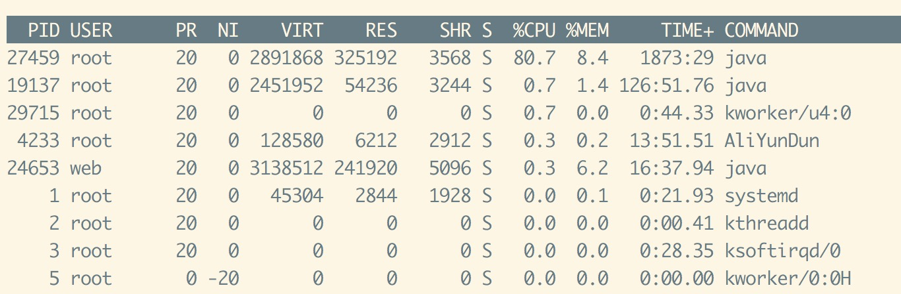
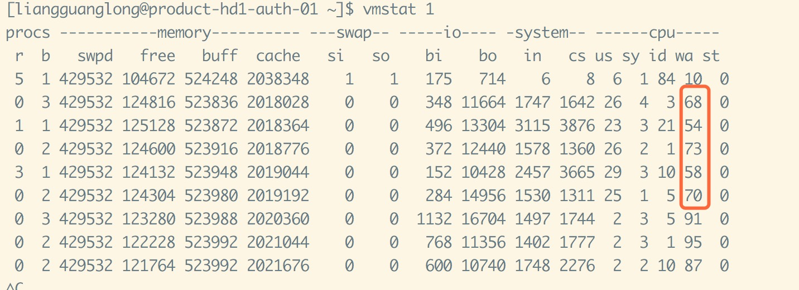
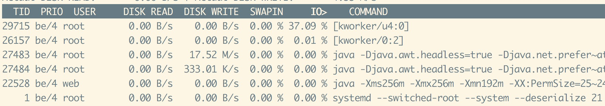
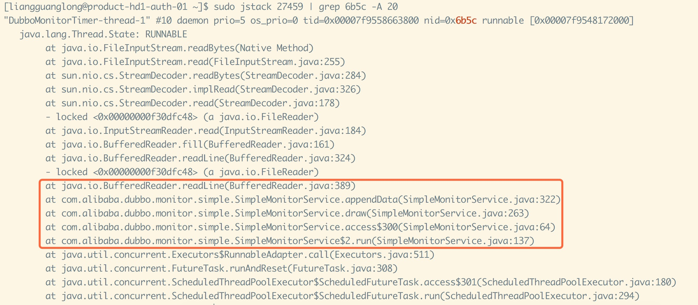

## 问题
   自从厂里将服务器从阿里云的经典网络全部迁移到VPC网络后，经常收到zabbix的某台服务器**CPU load is too high**告警，我们组的老司机
亲自上阵解决了，整个过程非常有代表性，下面具体说下过程。

## 定位过程

**1. 定位进程**
登录服务器后，执行top，分别输入 shift + p, 按照cpu排序查看进程，执行shift + m ,按照内存排序，定位到哪个进程是CPU耗的最高的。
  在这里看到是一个java进程  
  

**2. 查看IO**
使用 vmstat 查看iowait的情况,可以发现iowait是比较高的，但是是哪些线程呢  

**3.定位线程**
使用iotop 进行定位查看,可以看到某些线程在拼命写磁盘，这里线程id是 **TID**，具体在这里线程id是27484，转化为16进制是6b5c  
  

**4.jstack 查看线程栈**
学JVM的时候，知道jstack主要是用于生成java虚拟机当前时刻的线程快照，那可以直接将线程栈信息过滤出来，  
注意的的一点是，线程id在jstack信息里面是按照16进制显示，所以将定位到的线程id转换为16进制  
然后 **sudo jstack $pid | grep tid**,效果如下  
 

这个时候就知道具体的定位，dubbo-monitor会定时生成图表，会一直往磁盘写。  
解决方法？将磁盘改为SSD.......

## 最后  
借此感谢我们组的老司机，感谢已经离职的老大在过去大半年的指导，虽然被骂的多，但是比我过去几年收获的都要多。  
