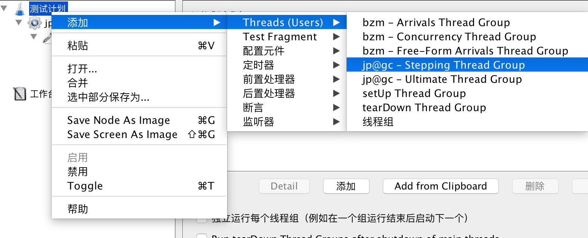

## 背景
前阵子我们负责接入大众点评的CAT来做链路监控，接入的时候发现有可能会影响服务性能，于是乎，我用jmeter对接入CAT的web项目和dubbo服务做了分布式压力测试。之前没有做过压力测试，这次基本是把jmeter的基础功能都大致走了一遍，踩遍了一次坑。

## 基本原理  
jmeter通过创建多个线程尽来模拟并发数，而做分布式压测，是考虑到单台jmeter压测服务器的性能有限，所以采用多台机器一起模拟高的并发数。分布式压测的时候，会设置其中一台为master，测试脚本会上传到master机器上，不需要上传到slave的压测机器，执行脚本的时候jmeter master会将jmx脚本传到slave机器，执行后将结果回传到master机器。  

## 测试前机器准备
采用linux服务器模拟生产环境进行压测，不要使用UI界面进行压测，官方文档说清了，UI界面执行的效果不佳，推荐使用脚本方式进行执行。  
**jmeter版本：** 统一使用3.2最新版本  
**linux服务器配置：**  
 2台jmeter 客户端，2核 8G，  
 1台dubbo服务部署服务器， 2核 8G  
**jmeter相关测试结果分析插件：**  
这些插件是用来分析和展示每次压测的结果，都是在PC端使用，linux服务器并不需要安装。  
 1. plugin manager,  用于管理所有的jmeter插件  
 2. Response Times Over Time， 用于展示响应时间的图表插件  
 3. Transactions per Second ， 用于展示TPS的图表插件  
 安装方式，插件下载之后，解压之后，内容分 XX.jar 和 文件夹ext，这里的XX.jar拷贝到jmeter安装目录lib目录，ext下的文件拷贝到 jmeter安装目录lib/extra目录，然后重启即可。

## 测试标准基线
在制定测试的性能基线时，请教了公司的QA，但是没有谁能给我一个很标准的参考，于是在请教了其他几个同事之后，大概定了以下的最低性能基线：
> 1. 接入CAT之后的TPS最多比没接入CAT的低10%  
> 2. 接入CAT之后的请求响应时间最多比没接入CAT的高10%  

## 测试思路
> 1. 部署测试的dubbo服务（没有接入CAT）在 部署机器    
> 2. 同时启动2个jmeter客户端，每个客户端各自开启2个线程，然后每隔30秒每个客户端再增加2个线程，直到最后每个客户端开启到20个线程，最后再持续运行1分钟后，每1秒钟关闭5个线程。  
> 3. 提前做好3台服务器的zabbix监控，监控CPU内存信息  
> 4. 部署测试的dubbo服务（有接入CAT）在 部署机器，重复2步骤  
> 5. 收集2次测试结果下载到本地进行图表展示和分析  

## 详细实施过程
### 1.准备jmeter测试脚本
jmeter支持多种请求，包括http请求、java请求、SOAP等，这次我们做的dubbo服务压测，所以是属于java请求。  
准备测试脚本是在jmeter UI进行创建测试计划，然后在将测试计划输出为jmx文件，即测试脚本。  
测试dubbo服务，主要分成2步：  
> 第一步：创建测试主类的jar包  

根据jmeter的文档，需要将测试内容打包成一个jar包放入jmeter安装目录 lib/ext下，然后测试主类需要继承AbstractJavaSamplerClient类，该类的主要方法如下：  
```
public Arguments getDefaultParameters();设置可用参数及的默认值；
public void setupTest(JavaSamplerContext arg0)：每个线程测试前执行一次，做一些初始化工作；
public SampleResult runTest(JavaSamplerContext arg0)：开始测试，从arg0参数可以获得参数值，调用逻辑在此；
public void teardownTest(JavaSamplerContext arg0)：测试结束时调用；
```
使用示例：  
```java
public class TestRisk extends AbstractJavaSamplerClient {
    private BlackRecordProvider blackRecordProvider;
    @Override
    public void setupTest(JavaSamplerContext context) {
        DubboInit init = DubboInit.getInstance();
        init.initApplicationContext();
        blackRecordProvider = (BlackRecordProvider)init.getBean("blackRecordProvider");
    }

    @Override
    public void teardownTest(JavaSamplerContext context) {
        super.teardownTest(context);
    }

    // 测试调用过程
    public SampleResult runTest(JavaSamplerContext javaSamplerContext) {
        SampleResult result = new SampleResult();
        result.sampleStart();
        BlackRecordRequest request = new BlackRecordRequest();
        request.setPage(1);
        request.setPageSize(10);
        try {
            BlackRecordResponse response = blackRecordProvider.queryBlackRecord(request);
            result.setSuccessful(true);
            result.setDataType(SampleResult.TEXT);
            result.setSamplerData(response.getMessage() + " " + response.getCode() +
                    " ");
        } catch (Exception e) {
            result.setSuccessful(false);
            result.setResponseMessage("exception:" + e.getMessage());
        } finally {
            result.sampleEnd();
        }
        return result;
    }
}
```

> 第二步，创建测试计划  

在准备好jar包之后，需要创建测试计划，测试计划主要包含线程组、Sample（请求类型），监听器（运行结果的分析展示）。举例说明：  
 1. **创建线程组**  
     
 "Stepping Thread Group" 是指在压测过程线程数会逐步上升 的线程组类型，并且制定每次增加之后运行多长时间，最后逐步关闭所有线程。  
 有个注意的地方是，这里的线程总数不可以太高，如果太大，比如开始就启动200个线程，那么服务器可能一下子就CPU 100%，看不到最佳的效果，没有接入和接入CAT的区别不明显。所以在这里采用一开始每台机器启动2个线程，然后每隔30秒添加2个线程进行压测，最终在每台测试机器的测试线程达到20线程的时候，逐步终止压测。这里的20，是根据脚本压测过程观察服务器在最大开启多少线程的时候，服务器会有性能瓶颈，也就是每核达到70%的使用率。  
 2. **创建java请求**  
     
 3. **添加分析解析结果的视图，包括TPS + 响应时间**   
  **添加响应时间**  
 
  **TPS**
 
 4. **保存测试计划**  
 点击保存，将测试计划存为jmx文件，也就是最终的测试脚本，并上传到jmeter压测客户端的服务器。  
### 2.jmeter客户端配置  
这一步主要是配置jmeter客户端压测的基本参数，主要是jmeter客户端的地址配置：  
修改bin/jmeter.properties修改remote_hosts为 2台jmeter客户端的ip:port，类似：  
remote_hosts=10.10.223.11:1888,10.10.223.12:1888  
### 3.执行jmx脚本  
jmeter -n -t -r XXX.jmx -l XXX.jtl  
将结果输出到jtl文件，然后下载jtl文件进行分析。  
注意点：  

> 1.测试过程需要及时看日志，确认是否连接上，日志文件在 bin/jmeter.log，确保压测的时候有连接上  
> 2.观察jmeter服务器负载，确认是否因客户端负载过高影响压测效果  

### 4.分析和统计测试结果  
### TPS
获得jtl文件之后，下载到本地，在jmeter客户端打开，分别2次打开压测结果的jtl文件，看看最终结果进行比较，如下：    
 
### Response Times Over Time
由于采用的是线程逐步递增的方式，可以在结果上看到响应时间是逐步的增高：  
 
 2次压测比较结果  
 

### 导出csv进行统计
将统计结果导出成csv文件，然后统计计算最终的结果  

然后根据时间段，比较下2种压测结果。  
**根据统计结果，接入CAT的dubbo服务会在造成10%左右的性能下降，属于可以接受范围**
