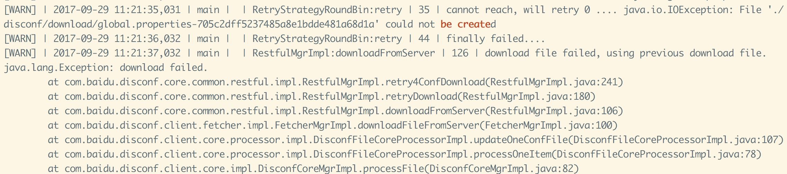
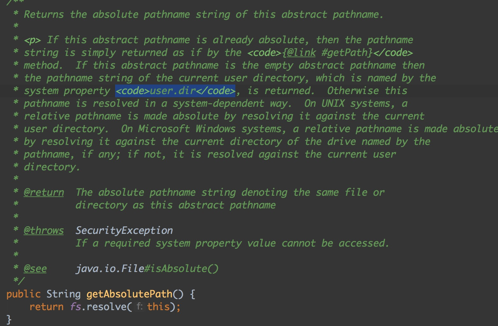
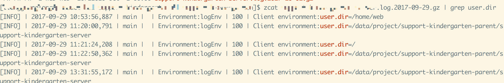

## 问题描述
最近有同事反馈，测试环境的disconf的配置文件经常下载失败，需要重复重启项目才能正常下载。我们去看了具体的业务日志显示如下：
  
这个问题导致不能正常使用disconf的配置文件，但是项目进程是起来的。

## 分析问题
1.使用wget http://XXX.com/api/config/file?version=1.0.0&app=YYY&env=test&key=KKK.properties&type=0 可以下载文件，判断不是网络问题或者disconf服务端问题导致  
2.从 ** './disconf/download/db.properties-66b56a68b58b40dcaf0379a72e73ae65' could not be created ** 可以判断最基本的原因是启动项目的用户没有权限创建目录和文件。  

## 定位问题  
### 1.跟踪异常栈  
从异常栈里可以看到，**FetcherMgrImpl.downloadFileFromServer** 方法调用的时候失败了，看看具体的操作是什么，
```java
public String downloadFileFromServer(String url, String fileName, String targetFileDir) throws Exception {
     // 下载的路径
     String localDir = getLocalDownloadDirPath();
     // 设置远程地址
     RemoteUrl remoteUrl = new RemoteUrl(url, hostList);
     // 下载
     return restfulMgr
             .downloadFromServer(remoteUrl, fileName, localDir, localDownloadDirTemp, targetFileDir,
                     enableLocalDownloadDirInClassPath,
                     retryTime,
                     retrySleepSeconds);
 }
```
我们要找的就是项目中定义的disconf下载的目录，所以追踪 **getLocalDownloadDirPath** 方法，发现是来源于DisClientConfig类的 **userDefineDownloadDir** 属性，其中这个属性是  
```java
    @DisInnerConfigAnnotation(name = "disconf.user_define_download_dir", defaultValue = "./disconf/download")
    public String userDefineDownloadDir = "./disconf/download";

```
所以就是项目的disconf配置文件的属性： **disconf.user_define_download_dir**，看了我们的项目配置是：  
**disconf.user_define_download_dir=./disconf/download**  
是当前目录的./disconf/download路径，  

### 2.跟踪restfulMgr.downloadFromServer方法  
源码是：
```java
    // 可重试的下载
    File tmpFilePathUniqueFile = retryDownload(localFileDirTemp, fileName, remoteUrl, retryTimes,
            retrySleepSeconds);

    // 将 tmp file copy localFileDir
    localFile = transfer2SpecifyDir(tmpFilePathUniqueFile, localFileDir, fileName, false);

    // mv 到指定目录
```
可以看出来大概就是三个步骤，我们聚焦的问题就是在下载环节，**retryDownload** ，所以跟下去看到  
```java
  private File retryDownload(String localFileDirTemp, String fileName, RemoteUrl remoteUrl, int retryTimes, int retrySleepSeconds) throws Exception {
       if (localFileDirTemp == null) {
           localFileDirTemp = "./disconf/download";
       }
       String tmpFilePath = OsUtil.pathJoin(localFileDirTemp, fileName);
       String tmpFilePathUnique = MyStringUtils.getRandomName(tmpFilePath);
       File tmpFilePathUniqueFile = new File(tmpFilePathUnique);
       retry4ConfDownload(remoteUrl, tmpFilePathUniqueFile, retryTimes, retrySleepSeconds);
       return tmpFilePathUniqueFile;
   }
```
这个方法是将一个临时目录放下载的文件，然后赋予下载的文件名一个随机名字（UUID），比如下载的文件名是叫 app.properties, 但是下载到localFileDirTemp的名字是 $localFileDirTemp/app.properties-XXXXXXX(UUID), 然后继续跟踪，查看retry4ConfDownload方法  
```java
  // 可重试的下载
  UnreliableInterface unreliableImpl = new FetchConfFile(url, localTmpFile);
  try {
     return retryStrategy.retry(unreliableImpl, retryTimes, sleepSeconds);
  }
```
retryStrategy.retry方法主要是调用了FetchConfFile的call方法，追到最后发现是调用FileUtils.copyURLToFile进行创建目录的时候由于权限问题导致目录不能创建，所以最终我们看到的异常就是  
```java
java.io.IOException: File './disconf/download/global.properties-705c2dff5237485a8e1bdde481a68d1a' could not be created
```
下载文件失败，因为当前用户这个localFileDirTemp没有权限创建，所以问题就集中在，localFileDirTemp目录的绝对路径是什么？  
我们看下jdk中File是怎么获取绝对路径的：  
   
 使用的是System.getProperty("user.dir")的路径，而oracle官方对user.dir的描述是：**User's current working directory**，也就是当前用户的工作目录。如果是当前用户的工作目录，所谓的工作目录是是什么呢，我们查了Stack Overflow，看到user.dir所对应的目录并不是用户的home目录，而是当前用户所处的目录，比如，www用户 cd /var， 那么www用户的user.dir是 **/var**
,而不是 **/home/www**。所以聚焦在这个点，我们在启动过程查看user.dir的具体路径。   

### 3.user.dir究竟是什么  
非常幸运的是，启动项目过程，zookeeper帮我们打印出了java的所有公共属性的内容，比如，user.dir,user.home等，所以把出错的日志就出来查看，果然有问题！！！  
  
 出错的那次user.dir竟然是 /   
 查看了脚本没发现问题，突然想起最近运维加了服务自动拉起脚本（监控服务挂了然后调用脚本启动），会不会是他那边导致的问题，去深入了解他们的脚本，发现是这样：  
 ```shell
sudo -u web XXX-restart.sh
 ```
它是通过root用户进行调用，拉起服务的，看了拉起脚本拉起的日志，看到刚好是我们进行正常发布过程的时候，中间有个间隔，进程被kill掉，拉起脚本检测到，自动又执行了一次启动脚本。  
也就是获取的user.dir不是web用户的home目录 或者 项目部署目录。  
那到底在 **sudo -u web XXX-restart.sh** 下，user.dir会是什么，我在本地打了一个简单的测试用例，然后打成一个jar包，写个执行的shell脚本执行，用户是kevin，具体如下：  
main方法：
```java
public static void main( String[] args ) throws IOException {
    String path = "./disconf/download/t1.text-uy8172g3hj3";
    File file = new File(path);
    System.out.println(System.getProperty("user.dir"));

    File parent = file.getParentFile();
    if (parent != null && parent.exists() == false) {
        if (parent.mkdirs() == false) {
            throw new IOException("File '" + file + "' could not be created");
        }
    }

    new FileOutputStream(file);
    System.out.println(file.getAbsolutePath());
}
```
shell脚本test.sh，创建用户是 kevin：  
java -cp /Users/kevin/project/tmp/testFile/target/testFile-1.0-SNAPSHOT.jar com.test.App  
测试方式 : 切换到root用户执行，cd /var && sudo -u kevin /Users/kevin/testShell/test.sh，结果如下：  
```
/private/var   (user.dir目录)
Exception in thread "main" java.io.IOException: File './disconf/download/t1.text-uy8172g3hj3' could not be created
	at com.test.App.main(App.java:26)
```
所以结论是，即使是通过shell指定用户执行 java类，获取到的 user.dir, 跟当前用户所在目录有关，而不是依赖于所指定的运行用户有关。所以即使拉起脚本指定了web用户，但是最终启动的用户路径还是执行 sudo -u web XXX-restart.sh 的用户所处的目录。因此没有权限创建目录。

## 解决
解决的方法挺简单的，在正式运行java程序的时候，先cd 到某一个 web用户完全有权限创建目录的 目录，比如 /home/web等  
或者另外一种方式：
配置disconf的 DisClientSysConfig 的系统配置disconf.local_download_dir 目录为一个web用户完全有权限创建目录的目录。

## 反思
花了我们组2天的时间去定位这个问题，而且是已经存在2个星期了，我们才发现这个问题，生产有一个项目受到此影响。  
所以总的来说我们有几点做的不好：  
> 1. 监控做的不到位，启动过程抛异常应该要捕捉住并且及时处理  
> 2. 运维部署拉起脚本，没有做好充分的测试  
