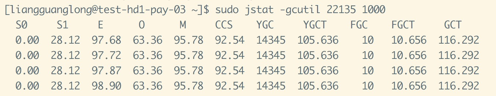

## 问题描述
前段时间，我们组负责的一个核心的服务被监控到出现full GC，而且是每隔2~3天出现一次full GC。

## 已知条件
> 1.生产环境采用的是jdk1.8  
> 2.服务的JVM参数如下：-Xms1024m -Xmx1024m -Xmn384m -Xss1m -server -d64 -XX:MetaspaceSize=64m -Dcom.sun.management.jmxremote -Dcom.sun.management.jmxremote.authenticate=false -Dcom.sun.management.jmxremote.ssl=false -Dcom.sun.management.jmxremote.port=12345 -XX:SurvivorRatio=8

触发 full GC的gc日志由于过了太久，找不到当时gc日志了，但是完全不妨碍这次问题的分析和跟踪。
从以上条件，可以简单看出，采用的是jvm默认的Parallel GC方式，按照此前的评估，1G的堆内存已经是完全足够了。

## 分析问题
当初一出现这个问题的时候，我们直接上服务器，用jstat 查看下具体的进程的gc信息，我尝试在测试环境还原了那个过程  
先使用  **jstat -gcutil $PID 1000** 查看gc信息，如下：  
  
可以看到触发了多少次GC ，停顿时间，以及每个空间的大小，这里基本上确认，该服务触发了full GC，而且每次平均在1S左右。  
然后查看具体每个空间的具体大小，使用 **jmap -heap $PID** 查看，发现有猫腻：  
```
Eden Space:
   capacity = 42467328 (40.5MB)
   used     = 26098160 (24.889144897460938MB)
   free     = 16369168 (15.610855102539062MB)
   61.45467875916281% used
From Space:
   capacity = 1048576 (1.0MB)
   used     = 294912 (0.28125MB)
   free     = 753664 (0.71875MB)
   28.125% used
To Space:
   capacity = 1048576 (1.0MB)
   used     = 0 (0.0MB)
   free     = 1048576 (1.0MB)
   0.0% used
```
这个是在测试环境还原当初生产环境的信息，堆内存分配了200M，设置了SurvivorRatio=8，但从上面可以看出，两个survivor区非常小，而eden区有40M，所以确认Eden space与 Survivor区的比例完全不是按照设置的 8:1:1来实行，而survivor区一旦过小，遇到稍微大点的对象，比如大数组，由于free空间不足，会直接进入 old space，最终导致old区会越来越大，到最后必然会触发full GC。  
为了保险起见，我们还手动dump了一次jvm内存进行分析，用MAT分析，没发现有什么大对象，看不出有什么问题，所以我们基本判断是jvm某种机制导致了survivor区的空间变得比较小，导致对象很多直接进入old 区，随着时间越来越多的对象进入old区，最终导致了full GC。
## 解决问题  
定位和分析之后，我们大致找到了这个问题的根本所在是jdk1.6之后默认开启了 **+UseAdaptiveSizePolicy** ，这个参数具体的作用：  
> 该特征对于收集时间、分配比例、收集之后堆的空闲空间等数据进行统计分析，然后以此为依据调整新生代和旧生代的大小以达到最佳效果  

在使用UseParallelGC的时候，回动态调整各个区域的大小，我们从一些gc日志可以看出  
```
2017-09-26T16:09:16.257+0800: 10.224: [Full GC (Metadata GC Threshold) [PSYoungGen: 4548K->0K(54784K)] [ParOldGen: 47469K->41171K(87552K)] 52017K->41171K(142336K), [Metaspace: 48101K->48101K(1093632K)], 0.1738299 secs] [Times: user=0.30 sys=0.01, real=0.17 secs]
2017-09-28T18:09:17.809+0800: 180011.776: [Full GC (Ergonomics) [PSYoungGen: 848K->0K(41984K)] [ParOldGen: 87524K->31662K(87552K)] 88372K->31662K(129536K), [Metaspace: 60732K->60547K(1105920K)], 0.3126632 secs] [Times: user=0.32 sys=0.00, real=0.31 secs]
```
在这里我们看到第一次full GC之后，metaspace大小是1093632K，到了第二次full GC 后，GC Ergonomics根据jvm对内部信息的统计分析之后，决定调整了metaspace的大小为1105920K。由此我们可以推断出survivor区也会有类似的调整，但是调整的结果不一定是最适合的，可能会调整成很小，间接导致了出现我们full GC的情况。  
由此我们也可推断，如果jvm参数设置 SurvivorRatio的情况，必须将UseAdaptiveSizePolicy进行关闭。  
所以我们将jvm参数补充 -UseAdaptiveSizePolicy，就解决了这个问题。

## 最后
JVM问题还是比较复杂的，当遇到full gc问题的时候，做了分析，但是不是能够最终确认就是这个原因导致的，我们补充了 -UseAdaptiveSizePolic参数，观察了1~2个星期，基本没有触发了full GC，我们才最终确认是这个问题导致的。
