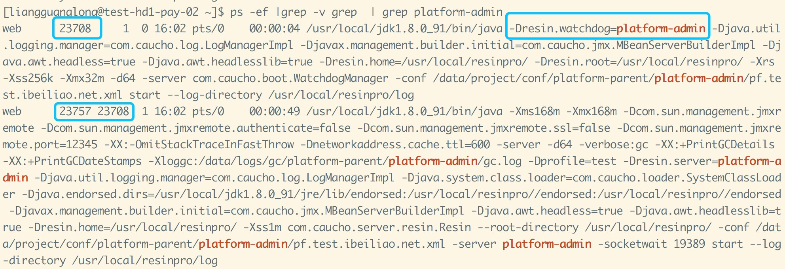
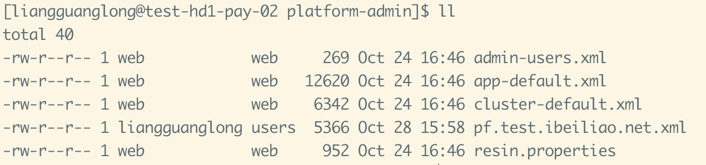

## 前言  
从去年开始，我们组开发了一套java的版本发布系统，作为主要的开发人员，在不断迭代的过程中，跟resin接触了不少，中间踩过很多坑，整个过程发现国内相关资料特别少，所以就打算写一个简单的resin入门，希望能对开发了解这个服务器有所帮助。

## 相比tomcat
resin有免费的社区版本和商业版本resin pro（非常昂贵，但是国内有破解版），抛开这个不说，从实际应用讲，resin有些地方做的的确比tomcat好，  

> 1.一台服务器安装一个resin服务器下，可以部署多个项目，并且可以对任意其中一个进行重启和关闭而不会影响到别的resin项目  
> 2.resin相对稳定，就tomcat而言，bug会相对多些，而且升级版本有可能会对原有项目造成影响（踩过坑的比较了解）
> 3.在一个resin部署了多个项目的情况下，每个项目都可以配置自己的jvm、线程等参数，并且每个项目都有自己的唯一标识，方便查找  

## 入门扫盲

### watch-dog
resin启动一个项目后，会生成2个进程，一个是watch-dog进程，一个是resin项目进程，如图所示：  
   
watch-dog进程跟项目进程是父子关系，从官网的描述来讲，watchdog就是用来做监控resin项目进程的，而且我们在手动kill resin进程的时候，不能直接kill resin项目进程，经过测试，直接kill项目进程的时候，watchdog会立即生成另外一个项目进程。所以只能通过kill watchdog进程来完成。

### 一个resin配置多个项目
resin相比其他很多应用服务器好的一点就是，可以安装一台resin服务器的情况下，同时启动多个项目，并且可以单独对其中一个项目进行操作而不需要对安装的resin服务器进行重启，因为一个resin项目就是一个resin实例，关闭其中一个实例不会影响到别的。  
使用上，在用resin脚本 resin.sh 启动的时候直接指定一个 resin的配置文件即可，而在我们内部的版本发布系统上，会给每个resin项目都生成一套resin的配置，在启动过程指定该配置文件即可。示例：
  
值得注意的配置文件就是pf.test.ibeiliao.net.xml，我们内部把域名作为核心的resin配置文件名   
```
<server id="platform-admin" address="127.0.0.1" port="6808">
  <watchdog-port>6608</watchdog-port>
  <http address="*" port="8088"/>
</server>
```   
以上是需要关注的几个因素，id，三个端口，  
id是标识项目 和 watchdog，启动后，resin进程和watchdog进程就会有响应的标志，方便开发者快速找到对应的进程，resin项目就是 -Dresin.server=platform-admin，watchdog的就是-Dresin.watchdog=platform-admin，这个在实际开发中非常有用。  
至于三个端口，6808是服务器内部通信端口，6608 是watchdog端口，8088是resin项目端口，也是对外通信端口。  
### JVM参数配置（有坑）
resin在4.0以上的版本，jvm参数统一采用一个参数放一行，类似这样：  
```
<jvm-arg>-Xms168m</jvm-arg>
<jvm-arg>-Xmx168m</jvm-arg>
```
而不是写在一行，这个不起眼的点把我们坑过一次，由于我们的所有resin配置文件都是生成的，这个生成过程，开发这个功能的同事是将jvm参数进行split，然后组装的，但是如果jvm参数在有很多段的时候，如果中间有多余的空格，就会导致生成的jvm参数类似这样：  
```
<jvm-arg>-Xms168m</jvm-arg>
<jvm-arg></jvm-arg>
<jvm-arg>-Xmx168m</jvm-arg>
```
中间那段是空的，而这个时候resin就抽风了，直接启动失败，错误日志没有提示是jvm参数的问题，直接启动失败，这个坑导致我们生产的一个项目不可用时间长达30分钟。
### 调优参数
类似tomcat，resin也有对应的参数调优，而且基本类似，  
相关参数：thread-min，thread-max，thread-keepalive
```
<!--最大线程数影响 resin 的系统负载能力以及 java 进程的内存占用-->
<thread-max>512</thread-max>
<!--keepalive 的最大数量，对网络性能有影响-->
<keepalive-max>128</keepalive-max>
```
这些参数具体使用多少，得根据实际的测试而定，测试的方法，网上提供的：   
将thread-min，thread-max，thread-keepalive三个参数设置的比较大，分别写上，1000，3000，1000，当然这是根据你的机器情况和可能同时访问的数量决定的，看看到底是线程达到多大的时候，java进程当掉的。然后将thread-min，thread-max，thread-keepalive分别写为150，400，300；也就是将当掉的时候的最大值稍微放大点，作为thread-max的值。  

### host别名
有些项目会有多个域名，这是比较常见的，在resin上，如果配置了A域名，但是没有配置另外一个域名名称，在nginx 转发到resin的时候，resin会识别host不是它所配置的域名，就直接拒绝了响应，所以这个时候nginx给到前端的响应就是 403（又是一次小坑的经历），resin也提供了host别名的配置来处理这个问题，   
```
<host-name>pf.test.ibeiliao.net</host-name>
<host-alias>hofool.com</host-alias>
```
### resin依赖包与项目冲突
resin是用java写的，用到了一些依赖包，其中比较容易产生冲突就是resin lib目录下的  
hibernate-validator-4.3.0.Final.jar  
validation-api-1.0.0.GA.jar  
jboss-logging-3.1.0.CR2.jar  
这些是比较容易产生冲突的，同事在测试的时候将冲突的validation包全移除，也不受影响，resin官方的建议是升级版本，但是我们在生产上的使用看，移除也没有受影响。
