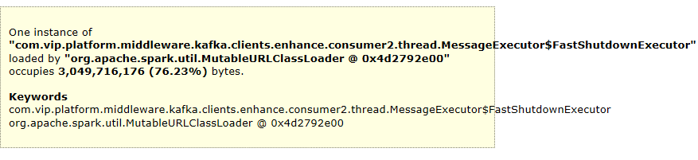

## 背景
我们有个spark应用正常跑了一个星期之后，在4月8号中午突然间spark SQL写hive暂停了，打开log一看，满屏的 Full GC，基本每隔1S左右FUll GC一次，每次费时 3-4S，偶尔有几次出现10几秒，看了log基本是老年代一直不变，每次GC前后的大小几乎没变化，内部运维监控系统查看，CPU一直持续 120%（由于特殊原因，内部spark应用暂时看不到jvm的监控信息）。我们这个时候的堆内存是开了8G，临时加到了16G堆内存，总共有8个节点实例，加了之后启动不到半分钟又触发了一个Full  GC, 表象还是老年代一直居高不下。 
### 排查  
出现Full GC的是在 spark driver，我们核心的业务逻辑（MQ消费，再对MQ做一系列的处理，最后才落地hive）都是在driver进行，由于heapdump下载的文件太慢，一开始我们没有执行heapdump，只是临时跑下 jhisto 查看哪些对象占用最多内存
```
jmap -histo pid | sort -n -r -k 3 | head 10
```

  

从上面看hashmap占了1.1G，vdpEvent对象占了800多M，byte数组占了800M
补充下：VDP是一个订阅mysql binlog，并且将binlog转化为MQ消息发给MQ消费者，这个类似于阿里巴巴的cannal。
这一步至少确认的一点就是vdpEvent对象出现了暴增的情况，而我们组同事也在业务log发现了这点，平时正常的情况，我们消费一条vdp的MQ消息，只有一条DB的记录，但是这次有8000+条，
问了VDP的负责人，vdp是根据一个事务来组装MQ消息的，比如一个事务涉及修改10条数据记录，那么我们订阅的vdp的MQ消息里面就有 10个VdpEvent
，如果一个事务涉及大量数据的话，vdp会根据一条MQ的大小上限，做拆分，按照目前的数据来看，拆分后1条MQ可以容纳8000+条记录（可以这么多是因为vdp做了压缩），MQ到了客户端之后就会解压。
但是vdpEvent 也不能完全解释不停Full GC, 后来还是做了heapDump

## heapdump分析
为了下载heapdump快点，我调整到了8G对内存，然后跑了几分钟后，陆续出现好几次Full GC 后，做了heapdump，下载下来后用MAT打开一看  
   

打开Leak Suspects，
   

发现有个内部消息中间件的消息线程池占了76%的内存，负责人看了下，分析一波，发现我们通过MQ client去消费MQ消息，采用的并发模式去消费，在并发模式的情况下，每个实例按照分区为维度默认会主动去拉1024个MQ消息到本地，然后再逐个扔给本地的消费线程去处理，我们有8个实例，总共有128个分区，那么每个实例有16个分区，每条MQ消息大概1MB，这样下来，每个实例大概有 1MB * 1024 * 16，理论上是16GB，但是vdp的消息是有经过压缩的，可能不会达到16GB，但是负责人基本确定就是这个问题导致的了。  

另外在MAT分析的时候发现另外一个隐患，本地开了8个消费线程，每个线程在VPD消息比较大的时候，每条线程占用了70MB的内存，看线程内部有个byte数组，这个其实就是MQ消息体，经过解压缩后的，在每条消息体有8000+个VdpEvent的情况下有大概30MB。这里说的隐患就是，有时候我们为了加快消费速度，配置了64个客户端线程或者更多，其实是很大风险的，假如遇到这种消息比较大的情况，64 * 70MB ，就有4.3GB的内存了，这个导致增加触发Full GC的风险。可以通过添加消费者的方式来加快消费速度，而不是添加消费线程。  
 


## 解决
分析下来，触发Full GC 的因素无非就是 一是VDP的消息体size在一些情况下会很大，最大到8000+ 条db记录，之前没问题跑了一个星期，是因为基本每条MQ只有一条记录，消息体经压缩后比较小；二是mq client单个消费分区的消息缓冲窗口大小,也就是拉取MQ缓存到本地的消息数量比较大，1024，调整小点就可以解决。

目前最好的方式就是，配置mq client拉取单这个配置在mq的文档有说到这个参数 mq.sla.consume.slide.window.size，即使是再次遇到这种情况，一个实例有16个分区，每条消息1MB，总共10条，160MB，还有压缩，基本很小了。  

业务上大多数出现Full GC的解决都不是调jvm参数，大多数还是业务层面来解决。


