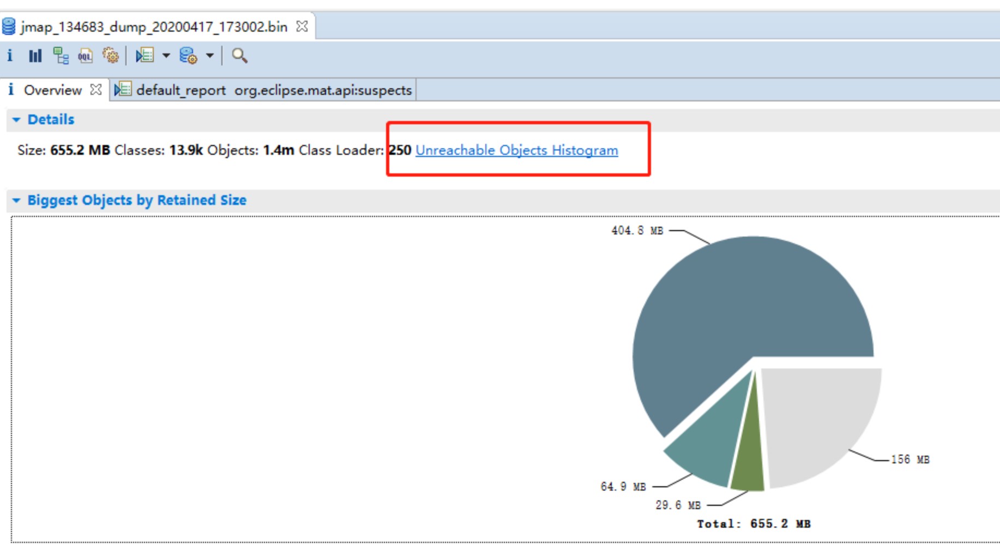
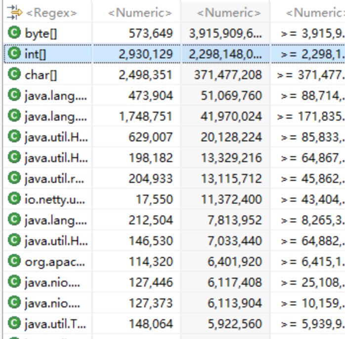
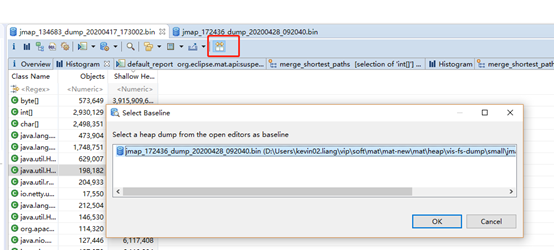
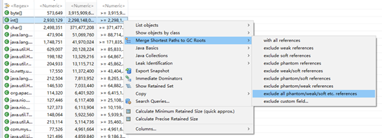
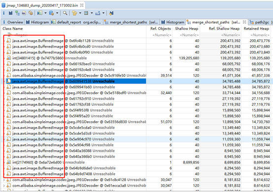
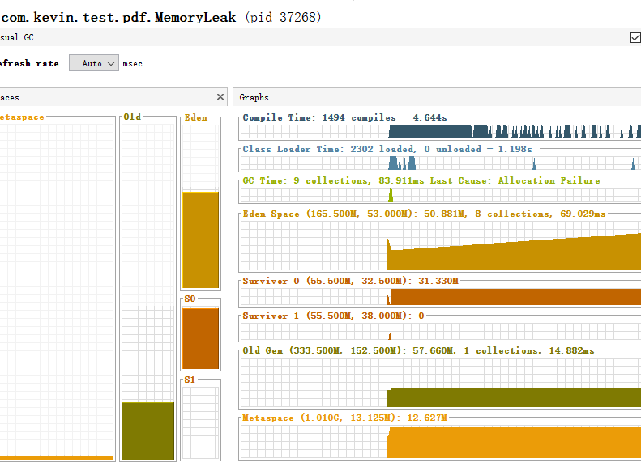

## 背景
组内有个文件系统是以前北京的同事离开的时候交接给我们，主要是用于vis内部文件上传，包括图片、pdf等，我们接手过来之后，经常隔一个星期或者几天就出现一次Full GC，每次这个系统的负责的同事操作都是，先涨堆内存，或者直接来一波重启，后面有事，就再重复一次操作。终于有一次，组长在群里发出这个系统告警的时候，我才发现这又是一个很有意思的问题，虽然它跟KPI半毛钱关系都没。
## 排查  
### 准备dump文件 
 在收到告警的时候，应用已经触发了Full GC, 但是依旧我还是常规性做了heapdump，拿到了大小为2G 左右的dump文件，我在这里记录为afterGC.dump，用处后面再说。  
 然后悄悄观察几天，一直等到old去一直涨到接近75% 阈值时，手动做了heap dump，拿到了一个接近7.2G左右的dump文件，称之为beforeGC.dump，注意不要 dump:live ~~   
 
### 分析dump文件  
打开MAT，注意一般dump文件有个 7 8G，用mat打开的时候可能会出现堆内存不足导致失败，所以需要配置下mat的堆内存大小，在mat的安装目录 的 MemoryAnalyzer.ini 文件里面，配置下Xmx，就拿我本次来说，配了2GB就可以了。
打开之后，发现分析的饼图跟7.2GB的dump文件大小完全对不上，一查才发现MAT默认把不可达的对象（unreachable objects）解析，详细见官方文档https://wiki.eclipse.org/MemoryAnalyzer/FAQ#How_to_analyse_unreachable_objects ，需要修改mat的默认配置， 
  

 重新分析beforeGC.dump之后，发现byte[] int[] 占了接近6GB，没有看到任何的业务对象
   

### dump文件对比
刚刚开始的时候 准备了gc之后的dump文件，这个时候打开，跟gc之前的dump文件对比下，看看主要是哪些对象发生了改变，方便查询问题。  
     

果然发现了一些异常，int[] 多出了2.8G，直接右键 选择**Merge Shortest Paths to GC Roots” -> "exclude all phantom/weak/soft etc. references**, 选择这个【exclude all phantom/weak/soft etc. references】意思是查看排除虚引用/弱引用/软引用等的引用链，因为被虚引用/弱引用/软引用的对象可以直接被GC给回收，所以不大可能是会触发Full GC的主要原因，我们要看的就是某个对象否还存在Strong 引用链。  
     

结果：  
     

发现所有的对象都是在这个 BufferedImage 上，并且注意都是 UNreachable，也就是可以被回收了
全局搜了下，没找到完整路径的引入，模糊匹配，终于发现了：  

```java
@Override
public String generateThumb(StorageBean storageBean,String thumb){
    //缩略图文件
    StringBuilder sourceFile = new StringBuilder();
    sourceFile.append(storageBean.getStorageLocation()).append(FileSystemConstant.SEPARATOR)
            .append(storageBean.getStorageUri()).append(".")
            .append(storageBean.getStorageType());
    //缩略图文件
    StringBuilder thumbFile = new StringBuilder();
    thumbFile.append(storageBean.getStorageLocation()).append(FileSystemConstant.SEPARATOR)
            .append(storageBean.getStorageUri()).append("_thumb_").append(thumb).append(".")
            .append(storageBean.getStorageType());
    //判断缩略图是否存在
    File file = new File(thumbFile.toString());
    String[] thumbs=thumb.split("x");//control层已做过验证，可直接使用
    if(!file.exists()){//不存在，生成缩略图(默认等比例缩放)
        try{
            File in = new File(sourceFile.toString()); // 原图片  
            FileInputStream inStream = new FileInputStream(in);  
            ImageWrapper imageWrapper = ImageReadHelper.read(inStream);
         
            Thumbnails.of(imageWrapper.getAsBufferedImage())   
            .size(Integer.parseInt(thumbs[0]), Integer.parseInt(thumbs[1]))   
            .toFile(thumbFile.toString());              
        }catch (IOException e){//缩略图生成异常，返回原图地址
            logger.error(String.format("缩略图生成异常:%s",e));    
            return sourceFile.toString();
        } catch (SimpleImageException e) {
            logger.error(String.format("缩略图生成异常:%s",e));    
            return sourceFile.toString();
        }
    }
    return thumbFile.toString();        
}
```

这个业务代码实际作用是实时生成图片的缩略图，生成的逻辑的过程, 在 java.awt.image.DataBufferInt #75  初始化了 3次大数组，数组的初始化大小为  图片的 宽 * 高 ，并且有触发3次，导致 一下子申请过多的连续内存。在前端并发请求情况下，  

```
public DataBufferInt(int size) {
    super(STABLE, TYPE_INT, size);
    data = new int[size];  // 图片 size = 宽 * 高
    bankdata = new int[1][];
    bankdata[0] = data;
}
```
写了一个简单的demo运行，通过visulVM监控各个区域内存使用，发现在 【500MB堆内存下，开10个线程去生成 10个缩略图，图片大小380kb，1920*900】会在 eden区有165MB内存的情况下，依旧是有对象进入到了老年代。
   

## 解决
从业务上解决，生成文件各个size的大小是在上传的时候就预先生成存储在文件系统，而不是每次访问都去生成一次。 然后访问的时候再根据文件id + size，获取到缩略图。


