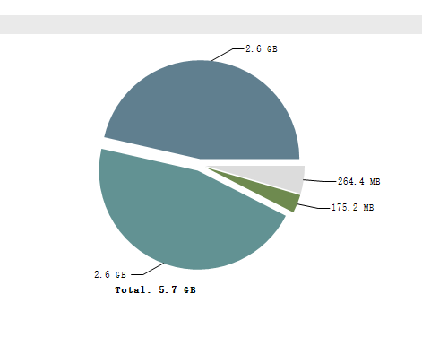
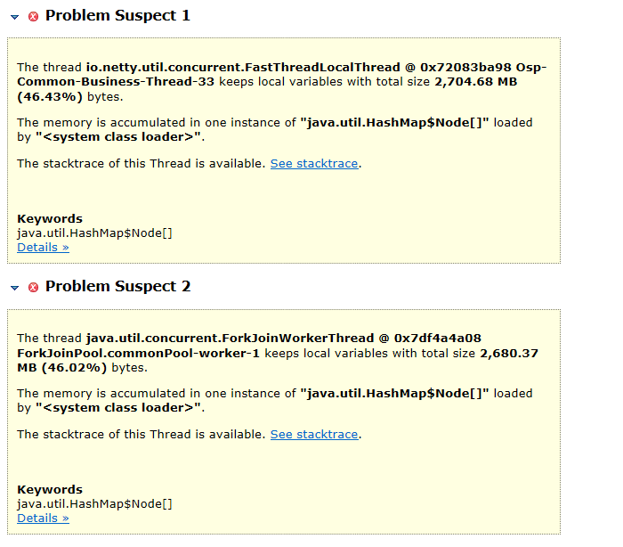
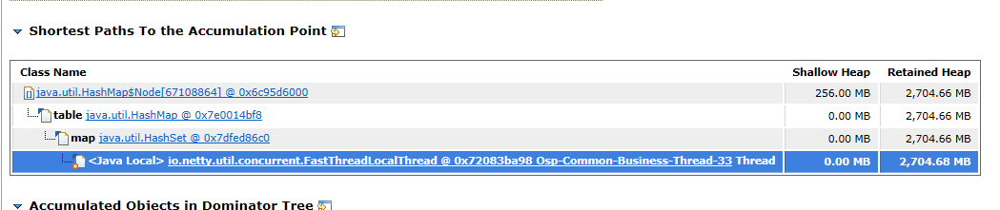
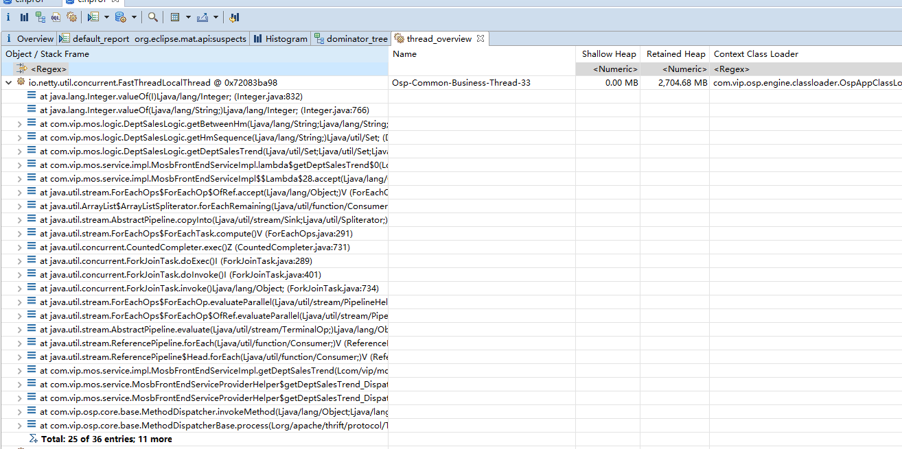
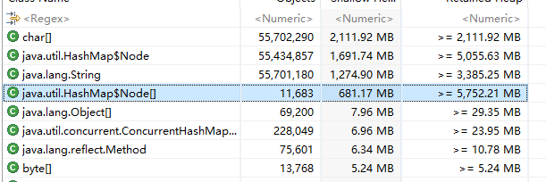
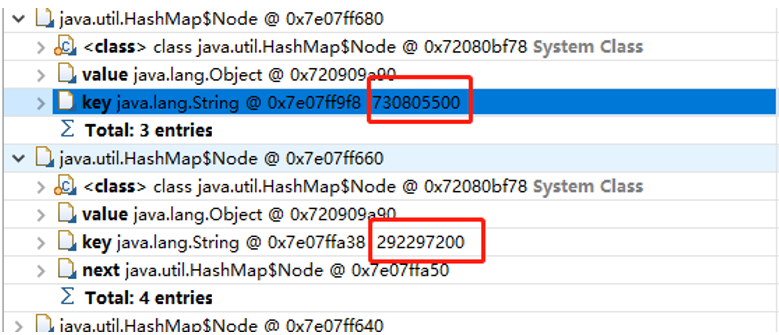

## 背景
前几天搞一次上线，在负责的核心系统搞出了一次FGC，表现是系统一直在FGC，老年代一直是居高不下，经过一顿猛操作，快速定位到是由死循环引起FGC，虽然排查过程不复杂，但是非常经典，是拿来给组内新人入门的最好案例。

## 排查过程
### 第一步：打开dump文件
快速做了heap dump之后，大概有8G，用MAT打开dump文件，花了好几分钟终于出了分析结果（如果打开很慢，建议打开MemoryAnalyzer.ini，设置下mat大点的堆内存，可以提速），看下饼图如下   
  
可以看出有2部分占用了很大对内存，但是具体是由什么对象占用的不知道。  

### 第二步：查看报告
打开Leak Suspect，查看下报告，目的是看出是哪些线程占用了这些大对象，如图  
  
可以看出是2个线程的本地变量分别占用了46%的堆内存，而且都是在一个HashMap的节点，也就是这2个线程占用了92%的堆内存，一直GC不掉。
点击detail，查看是什么对象占用，  
  
从这里可以看出报告的HashMap是属于一个HashSet对象里面，但是这个HashSet是在代码的哪一行的呢

### 第三步：打开线程栈
查看当前的线程栈，看看对象所在的线程的线程栈，然后再逐个追到大对象HashSet是这个线程栈的哪一个变量，用mat打开线程栈，找到大对象所在的线程，然后点击打开线程栈  
  
可以清晰看到大对象对应的是线程的线程栈，初步缩小范围到一个某几个HashSet，但是那几个大的HashSet里面的内容是什么呢

### 第四步：查看大对象的内容
点击查看对象分布，找到最大对象  
    
看到HashMap$Node，一层层点击进去查看，看到每一个Node的内容的key都是类似**XXX00**的数据，而value都是同一个对象，
 
判断这个是HashSet的内存信息，同时发现HashMap$Node 数量高达5000W个，因此断定那个大的HashSet的内容都是**XXX00**的数据
 ，根据内容和线程栈，结合代码找到了根因。  

### 第五步：最终定位
根据第二步的报告中，有提到ForkJoin的线程名字，外加对象内容是 XXX00 这种格式的数据，找到了代码：  

```java
    List<String> list = Lists.newArrayList("1", "2");
    // minHm maxHm 是外部传进来的
    String minHm = "0100", maxHm = "2300";
    int interval = 100;
    list.parallelStream().forEach(e -> {
        String start = minHm;
        while (!start.equals(maxHm)) {
            int startInt = Integer.parseInt(start);
            startInt = startInt + interval;
            String addStartStr = String.valueOf(startInt);
            start = addStartStr.length() == 4 ? addStartStr : "0" + addStartStr;
        }
    });
```
这段代码本身是为了实现小时分区相加的功能，从一点加到23点然后结束，但是如果传入的minHm 是 **0130**这种数据的话，那么开始的
小时分区就永远不可能等于maxHm的结束分区，就会导致死循环一直加到Integer的最大值。又因为采用了parallelStream，所以线程栈会有ForkJoinWorkerThread的标识。  
